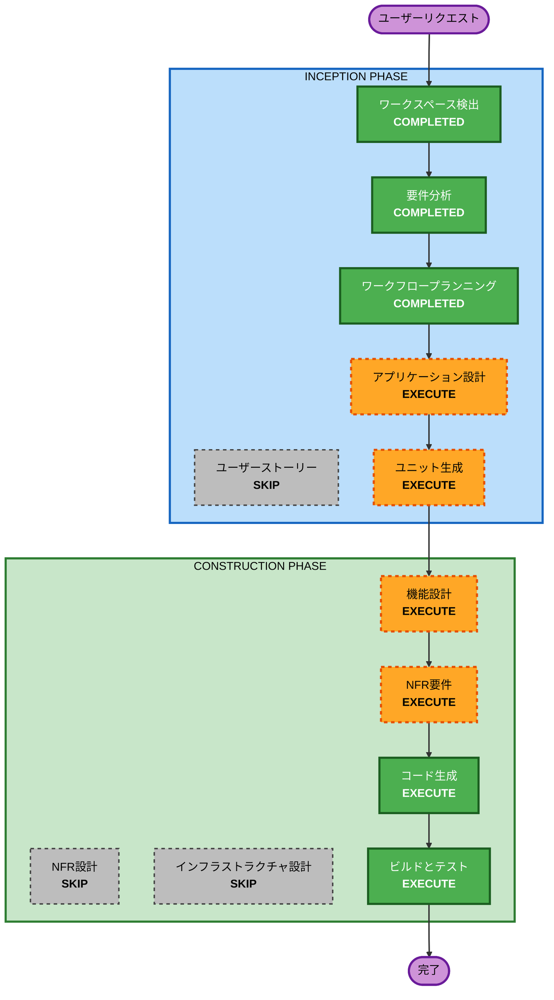

# 実行計画

## 詳細分析サマリー

### 変更影響の評価

- **ユーザー向けの変更**：はい - 新規TUIアプリケーション。全機能がユーザー向け
- **構造的な変更**：はい - 新規プロジェクト構造全体の設計が必要
- **データモデルの変更**：いいえ - データ永続化層なし（GitLab APIからの取得のみ）
- **APIの変更**：いいえ - 外部API（GitLab REST API）を消費するのみ
- **NFRへの影響**：はい - セキュリティベースライン適用、パフォーマンス要件あり

### リスク評価

- **リスクレベル**：中
- **ロールバックの複雑さ**：簡単（新規プロジェクトのため）
- **テストの複雑さ**：適度（API連携のモック、TUI操作テストが必要）

## ワークフローの可視化



### テキスト代替

```
INCEPTION PHASE:
  1. ワークスペース検出        [COMPLETED]
  2. 要件分析                  [COMPLETED]
  3. ユーザーストーリー        [SKIP]
  4. ワークフロープランニング  [COMPLETED]
  5. アプリケーション設計      [EXECUTE]
  6. ユニット生成              [EXECUTE]

CONSTRUCTION PHASE:
  7. 機能設計（ユニットごと）  [EXECUTE]
  8. NFR要件（ユニットごと）   [EXECUTE]
  9. NFR設計                   [SKIP]
 10. インフラストラクチャ設計  [SKIP]
 11. コード生成（ユニットごと）[EXECUTE]
 12. ビルドとテスト            [EXECUTE]
```

## 実行するフェーズ

### INCEPTION PHASE

- [x] ワークスペース検出（完了）
- [x] 要件分析（完了）
- [x] ユーザーストーリー - SKIP
  - **理由**：単一ユーザータイプ（開発者）の開発ツール。ペルソナ分析は不要
- [x] ワークフロープランニング（完了）
- [ ] アプリケーション設計 - EXECUTE
  - **理由**：新規プロジェクト。複数コンポーネント（TUI層、API層、設定管理）の設計が必要
- [ ] ユニット生成 - EXECUTE
  - **理由**：複数の独立した作業単位に分解可能。並行作業の明確化が必要

### CONSTRUCTION PHASE

- [ ] 機能設計 - EXECUTE（ユニットごと）
  - **理由**：MR一覧取得、差分表示、コメント投稿等の複雑なビジネスロジックあり
- [ ] NFR要件 - EXECUTE（ユニットごと）
  - **理由**：セキュリティベースライン適用。技術スタック選定（TUIフレームワーク、GitLabクライアント）が必要
- [ ] NFR設計 - SKIP
  - **理由**：NFR要件で技術スタックを決定すれば十分。インフラパターンの組み込みは不要（ローカルCLIツール）
- [ ] インフラストラクチャ設計 - SKIP
  - **理由**：ローカル実行のCLIツール。クラウドインフラストラクチャ不要
- [ ] コード生成 - EXECUTE（ユニットごと）
  - **理由**：実装が必要（常時実行）
- [ ] ビルドとテスト - EXECUTE
  - **理由**：ビルド、テスト、検証が必要（常時実行）

### OPERATIONS PHASE

- [ ] オペレーション - PLACEHOLDER
  - **理由**：将来のデプロイメントとモニタリングワークフロー

## 成功基準

- **主要目標**：ターミナル上でGitLab MRの閲覧・コメントが可能なTUIアプリケーション
- **主要成果物**：
  - Pythonパッケージ（pip install可能）
  - TUIアプリケーション本体
  - 設定ファイルテンプレート
  - テストスイート
  - README（使用方法）
- **品質ゲート**：
  - 全テスト通過
  - セキュリティベースラインルール準拠
  - MR一覧表示、差分表示、コメント追加の基本フローが動作
